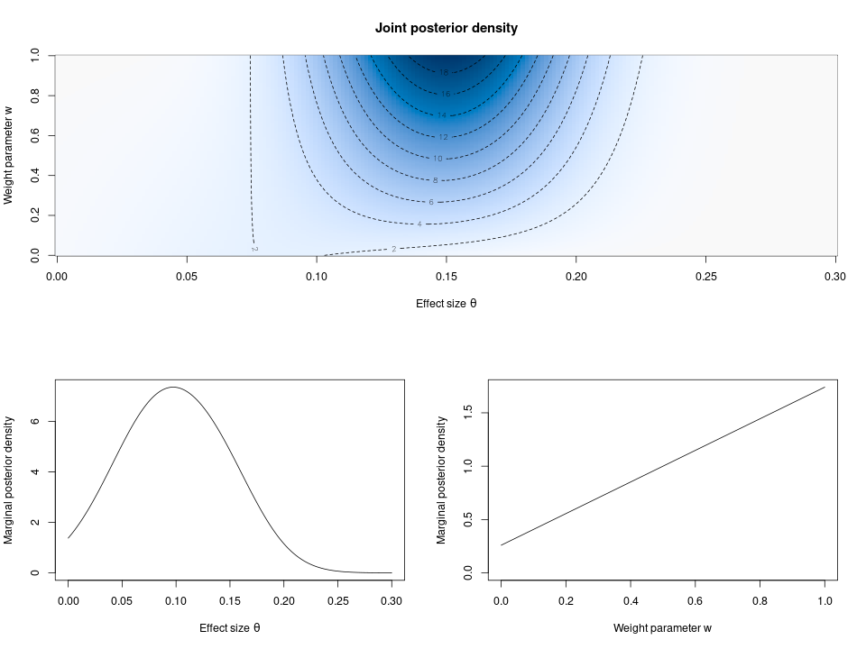

# repmix

**repmix** is an R package for Bayesian estimation and testing of effect sizes
based on data from an original study and its replication using a mixture prior
framework. For more information, see the upcoming preprint

Macrì Demartino, R., Egidi, L., Held, L., Pawel, S. (2024). Mixture priors for
replication studies. 

<!-- TODO add link to preprint -->

## Installation

```r
## ## CRAN version (not yet available on CRAN)
## install.packages("repmix")

## from GitHub
## install.packages("remotes") # requires remotes package
remotes::install_github(repo = "SamCH93/repmix")
```

## Usage
The code below illustrates an example analysis of a replication study using the
package.

``` r
library("repmix")

## original SMD effect estimate and standard error
to <- 0.21
so <- 0.05

## replication SMD effect estimate and standard error
tr <- 0.09
sr <- 0.05

## uniform prior for mixture weight w ~ Beta(x = 1, y = 1)
x <- 1
y <- 1

## vague normal prior for non-informative mixture component
m <- 0
v <- 4

## compute 95% HPD credible intervals for mixture weight
wHPD(level = 0.95, tr = tr, sr = sr, to = to, so = so, x = x, y = y, m = m, 
     v = v)
     
#>     lower    median     upper 
#> 0.1382110 0.6649712 1.0000000 

## compute 95% HPD credible intervals for effect size
thetaHPD(level = 0.95, tr = tr, sr = sr, to = to, so = so, x = x, y = y, 
         m = m, v = v)
         
#>        lower       median        upper 
#> -0.003667578  0.097993140  0.198979243 

## compute joint and marginal posterior densities
ngrid <- 200
theta <- seq(0, 0.3, length.out = ngrid)
w <- seq(0, 1, length.out = ngrid)
parGrid <- expand.grid(w = w, theta = theta)
postjoint <- posteriormix(theta = parGrid$theta, w = parGrid$w, tr = tr, 
                          sr = sr, to = to, so = so, x = x, y = y, m = m, 
                          v = v)
postdensMat <- matrix(data = postjoint, ncol = ngrid, byrow = TRUE)
posttheta <- thetaposteriormix(theta = theta, tr = tr, sr = sr, to = to, 
                               so = so, x = x, y = y, m = m, v = v)
postw <- wposteriormix(w = w, tr = tr, sr = sr, to = to, so = so, x = x,
                       y = y, m = m, v = v)
        
## plot joint and marginal posterior densities
layout(matrix(c(1, 1, 2, 3), byrow = TRUE, ncol = 2))
image(x = theta, y = w, z = postdensMat, xlab = bquote("Effect size" ~ theta),
      ylab = "Weight parameter w", main = "Joint posterior density",
      col = hcl.colors(n = ngrid, palette = "Blues 3", rev = TRUE))
contour(x = theta, y = w, z = postdensMat, add = TRUE, lty = 2)
plot(x = theta, y = posttheta, type = "l", xlab = bquote("Effect size" ~ theta), 
     ylab = "Marginal posterior density", ylim = c(0, max(posttheta)))
plot(x = w, y = postw, type = "l", xlab = "Weight parameter w", 
     ylab = "Marginal posterior density", ylim = c(0, max(postw)))
```


<!-- png(filename = "posterior.png", width = 1.2*800, height = 1.2*600, pointsize = 15); .....; dev.off() -->
